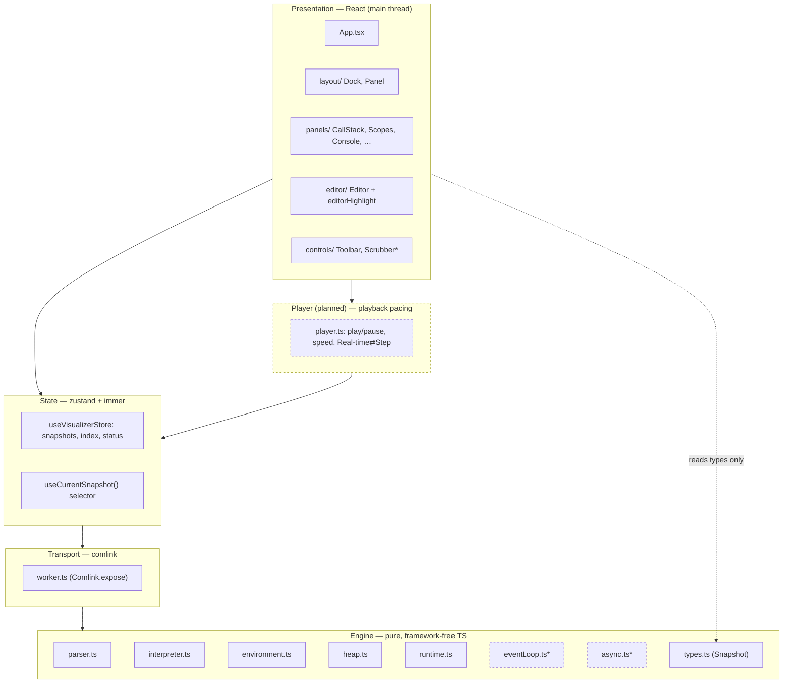
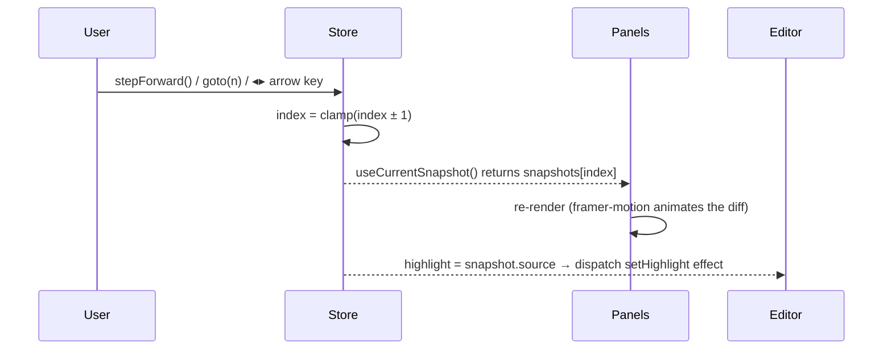
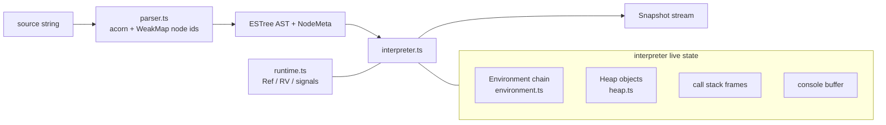
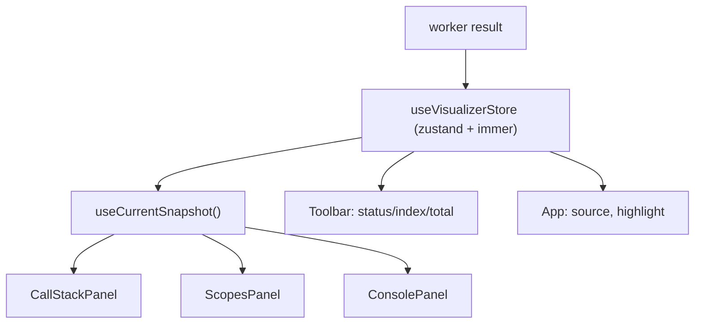
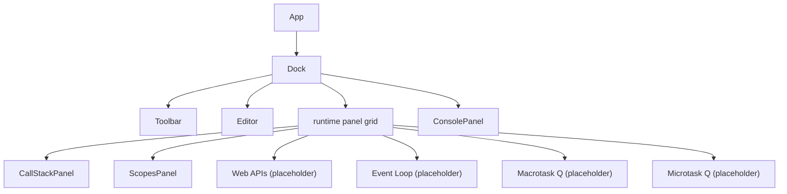
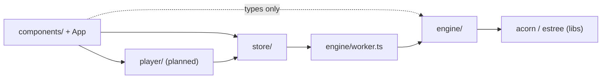

# Architecture — JavaScript Runtime Visualizer

> **New here? Read [`ARCHITECTURE_OVERVIEW.md`](./ARCHITECTURE_OVERVIEW.md) first** — a 5-minute,
> plain-language tour. This document is the detailed reference.
>
> Status: reflects the codebase through **Phase 2** (engine + core panels), with the
> forward-looking sections marked _(planned)_. For the product vision see `PLAN.md`;
> for the build sequence see `IMPLEMENTATION_PLAN.md`.

## Contents
1. [Purpose & scope](#1-purpose--scope)
2. [The four load-bearing principles](#2-the-four-load-bearing-principles)
3. [System context](#3-system-context)
4. [Layered architecture](#4-layered-architecture)
5. [The data contract: `Snapshot`](#5-the-data-contract-snapshot)
6. [Runtime data flow](#6-runtime-data-flow)
7. [Engine internals](#7-engine-internals)
8. [State management](#8-state-management)
9. [Presentation & animation](#9-presentation--animation)
10. [Concurrency model](#10-concurrency-model)
11. [Performance strategy](#11-performance-strategy)
12. [Error handling & resilience](#12-error-handling--resilience)
13. [Module dependency rules](#13-module-dependency-rules)
14. [Directory structure](#14-directory-structure)
15. [Extensibility playbooks](#15-extensibility-playbooks)
16. [Testing strategy](#16-testing-strategy)
17. [Technology choices](#17-technology-choices)
18. [Architecture decision log](#18-architecture-decision-log)
19. [Roadmap → architecture mapping](#19-roadmap--architecture-mapping)

---

## 1. Purpose & scope

A browser app that **executes user JavaScript in our own interpreter** and renders the
execution — call stack, scopes/closures, the event loop, console, and (later) an AST and
object graph — as a **scrubbable, animated timeline**.

We do not wrap a real JS engine. Real engines hide the call stack frames, scope records, and
the macrotask/microtask queues we exist to teach. By running a custom tree-walking interpreter
we own every one of those structures and can pause, step, rewind, and inspect them.

**In scope:** a teaching subset of modern JS (functions/closures, control flow, objects/arrays,
`try/catch`, and — by Phase 4 — timers, promises, `async/await`).
**Out of scope (v1):** full spec compliance, classes, generators-as-syntax, ES modules,
real GC simulation.

---

## 2. The four load-bearing principles

These are invariants. Violating any one breaks the system in ways that are hard to debug.

| # | Principle | Why it matters | Enforced by |
|---|-----------|----------------|-------------|
| **P1** | **Deterministic logic, cosmetic timing.** Execution ordering is computed deterministically up front; wall-clock time only paces *playback*. | Lets real-time animation and reliable scrub/step-back coexist. No `Date.now()`/`Math.random()` in ordering. | Interpreter is a pure function of source; the only `Date.now()` is the safety guard (`interpreter.ts`). |
| **P2** | **One `Snapshot` is the single source of truth.** Every panel is a pure render of the current snapshot. | Stepping = moving an index; everything re-derives. No panel can drift out of sync. | Panels read `useCurrentSnapshot()`; new data must be a `Snapshot` field. |
| **P3** | **Engine runs off the main thread** (Web Worker). | A 50k-step or infinite program never janks the 60fps UI. | `engine/worker.ts` + comlink; UI only ever sees serialized snapshots. |
| **P4** | **Structural sharing for time-travel.** Env/heap views are versioned and shared by id across snapshots. | Thousands of snapshots stay cheap — no deep copy per step. | `rev` counter + serialize cache keyed by `(id, rev)`. |

---

## 3. System context

```
                         ┌──────────────────────────────────────────┐
                         │                Browser tab                │
                         │                                           │
   ┌─────────┐  types    │   ┌───────────────┐    ┌──────────────┐  │
   │  User    │ ───────▶ │   │  UI (main      │    │ Engine        │  │
   │ (writes  │  source  │   │  thread):      │◀──▶│ (Web Worker): │  │
   │   JS)    │ ◀─────── │   │  React + CM6   │ RPC│ interpreter   │  │
   └─────────┘  visuals  │   │  + zustand     │    │ (pure TS)     │  │
                         │   └───────────────┘    └──────────────┘  │
                         └──────────────────────────────────────────┘
                          No network. No backend. 100% client-side, static-deployable.
```

The entire system is a static bundle. The only "service" boundary is the **main thread ⇄ worker**
boundary, crossed by structured-clone over comlink.

---

## 4. Layered architecture

Five layers, each depending only on the one below it. The arrows are the *only* allowed
dependency directions.



\* = planned (Phase 3+).

**Key boundary rule:** the **Engine** layer never imports React, the DOM, the store, or any
UI code. It is plain TypeScript, unit-testable in isolation, and is the only place execution
semantics live. The Presentation layer may import engine **types** (`@/engine`) but never calls
the interpreter directly — it goes through the store → worker.

---

## 5. The data contract: `Snapshot`

`Snapshot` (`src/engine/types.ts`) is the interface between engine and UI. It is the contract
that makes P2 possible: if a panel needs to show something, it must be a field here.

```ts
interface Snapshot {
  stepId: number
  kind: 'program' | 'statement' | 'expression' | 'call' | 'return'
  phase: 'sync' | 'microtask' | 'macrotask'
  astNodeId: string                       // → AST highlight + editor sub-token highlight
  source: SourceSpan | null               // char offsets + line/col, drives editor highlight
  callStack: FrameView[]                   // bottom (global) → current; args + returnValue
  activeEnvId: string                      // entry point into the scope chain
  environments: Record<string, EnvView>    // id → scope view (structurally shared)
  heap: Record<string, HeapNodeView>       // id → object/array/function view (shared)
  console: ConsoleEntry[]                  // cumulative; each carries its originating stepId
  explain?: string                         // guided-mode annotation (Phase 4+)
  // webApis / macrotaskQueue / microtaskQueue — added in Phase 3-4
}
```

Properties of the contract:
- **Serializable.** No class instances, no functions — survives structured-clone across the
  worker boundary and `JSON.stringify` in tests.
- **Self-contained per step.** A panel renders snapshot _N_ without needing _N-1_ (pulses are a
  pure UI nicety computed by comparing reprs across renders, never required for correctness).
- **Id-referenced.** `callStack[i].envId`, `activeEnvId`, and heap refs point into the
  `environments`/`heap` maps — see structural sharing (§11).
- **View vs runtime split.** The engine's live values (`RV`, `Environment`, `HeapObject`) never
  leave the worker. They are projected into display-only `*View` types at each step.

---

## 6. Runtime data flow

### 6.1 Run (compute the whole timeline)

```mermaid
sequenceDiagram
    participant U as User
    participant T as Toolbar
    participant St as Store (main)
    participant W as Worker
    participant I as Interpreter
    U->>T: click Run
    T->>St: run()
    St->>St: status = 'running'; clear snapshots
    St->>W: engine.run(source, {maxSteps}) (comlink)
    W->>I: runProgram(source)
    I->>I: parse → AST + node ids
    loop each step (generator yield)
        I->>I: eval node, mutate live state
        I->>I: pushSnapshot() (serialize w/ rev-cache)
        I->>I: guard() — step/time budget
    end
    I-->>W: RunResult { snapshots[], error }
    W-->>St: structured-clone(result)
    St->>St: snapshots = result; index = 0; status = 'ready'
    St-->>T: re-render (all panels derive from snapshots[0])
```

The entire execution is computed in one RPC call. There is **no streaming back step-by-step**
in Phase 1–2 — the interpreter is fast and deterministic, so we compute the full array and let
the UI scrub it. (A streaming/incremental variant is a possible future optimization for very
large programs; the contract already supports it.)

### 6.2 Step / scrub (navigate the timeline)



Stepping touches **only an integer** (`index`). This is the entire reason scrubbing is instant
and step-back is free: no recomputation, just re-indexing into an immutable array.

---

## 7. Engine internals

The engine is a **generator-based tree-walking interpreter** that emits one `Snapshot` per
meaningful step.



### 7.1 Stepping via generators
`evalNode`-style methods are generators (`function* execStatement`, `function* evalExpr`). They
`yield` a `Step {kind, node, env}` at each granularity point and delegate with `yield*`. The
driver (`run()`) pulls steps; after each yield it calls `pushSnapshot()` and `guard()`. This
gives uniform, interruptible stepping and is the mechanism the event-loop scheduler will reuse
to interleave jobs in Phase 3–4.

### 7.2 Scopes & closures
`Environment { id, kind, parent, bindings, rev }`. The `parent` chain *is* the scope chain; a
closure is simply a heap function value holding a live reference to its defining `Environment`.
`let`/`const` are hoisted into their block as **uninitialized** (TDZ); `var`/functions hoist to
the function scope. Per-iteration `let` bindings in `for` loops are modeled by copying the loop
environment each iteration — which is what makes the classic closure-in-a-loop demo correct.

### 7.3 Heap & values
`runtime.ts` defines `RV = number | string | boolean | null | undefined | Ref`. A `Ref` is an
opaque id into the `Heap`, which owns objects, arrays, and functions. Keeping refs distinct from
primitives makes the heap the single owner of mutable state and powers the object graph (Phase 5).

### 7.4 Control flow via signals
`return`/`break`/`continue`/`throw` are thrown as `ReturnSignal`/`BreakSignal`/
`ContinueSignal`/`ThrowSignal` and caught at the right boundaries (function call, loop,
try/catch). This keeps the tree-walker's control flow clean across generator delegation.

### 7.5 Safety guard
`guard()` aborts when snapshots exceed `maxSteps` (default 50k) or wall-clock exceeds `maxMs`.
This is the **one** place real time is read, and it only *stops* runaway code — it never affects
ordering (P1 preserved).

---

## 8. State management



Store shape: `{ source, snapshots, index, status, error }` + actions `setSource`, `run`,
`stepForward`, `stepBackward`, `goto`, `reset`.

**Selector discipline (a hard-won rule).** zustand uses `useSyncExternalStore`, which throws
*"Maximum update depth exceeded"* if a selector returns a **new reference every call**. So:
- Select the **stable snapshot object** via `useCurrentSnapshot()`, then derive `.callStack` /
  `.console` in render with a **module-level empty fallback** (`const NO_FRAMES = []`).
- Never write `useStore(s => s.snapshots[s.index]?.callStack ?? [])` — the `?? []` allocates a
  fresh array each render and loops forever.

The **player** (Phase 3) will sit beside the store, driving `index` over time (via
`requestAnimationFrame`) for play/pause and Real-time⇄Step pacing — it computes nothing, it only
advances the index.

---

## 9. Presentation & animation



- **Panels are pure renders** of the current snapshot (`Panel` is the shared collapsible card).
- **Animation** uses framer-motion's `layout` prop + `AnimatePresence` so stack pushes/pops and
  (later) queue enqueues/dequeues animate from the *diff between snapshots* — we never hand-tween
  positions. Value-change pulses are local component state comparing the previous repr.
- **Editor highlight** is a CodeMirror 6 decoration layer (`editorHighlight.ts`): a `StateField`
  holding a `DecorationSet`, updated by dispatching a `setHighlight` `StateEffect` when the
  snapshot changes. Offsets come straight from `snapshot.source`.
- **`prefers-reduced-motion`** is globally damped in `index.css`.
- **Styling**: Tailwind v4 with CSS-var design tokens under `@theme`/`:root`/`.dark`; region
  accent colors (`--color-stack`, `--color-macrotask`, `--color-microtask`, `--color-webapi`)
  give each runtime region a consistent identity across panels.

---

## 10. Concurrency model

```
 main thread (60fps)                         worker thread
 ─────────────────────                       ───────────────────────
 React render / animation                    parse + interpret (CPU-heavy)
 zustand state + index                       produce Snapshot[]
 CodeMirror editing            comlink RPC   guard against infinite loops
        │   engine.run(source) ───────────▶  runProgram(...)
        │   ◀─────────────────── result      (structured clone)
        ▼
 scrub index → re-render (pure, cheap)
```

- The worker is **stateless between runs** — each `run()` is a fresh `Interpreter`. No shared
  mutable state across the boundary; only immutable snapshots cross it.
- Structured clone **preserves shared references within a single message**, so the structural
  sharing built in the worker survives transfer (the UI receives shared view objects too).
- The main thread never blocks on execution; even `while(true){}` is bounded by the guard in the
  worker and returns an error result.

---

## 11. Performance strategy

| Concern | Strategy |
|---|---|
| Thousands of snapshots in memory | **Structural sharing.** Each `Environment`/`HeapObject` has a `rev` bumped on mutation; `serializeEnv/heapView` cache by `(id, rev)` and return the *same* view object when unchanged. Adjacent snapshots share most of their `environments`/`heap` view objects. |
| Per-step serialization cost | Only changed nodes rebuild a view; the rest are cache hits. `console` is a shallow `slice()` (shares entry objects). |
| UI re-render cost | Panels select the stable snapshot and derive locally; React reconciles via stable keys (`frame.id`, `env.id`, binding `name`). |
| Animation jank | framer-motion `layout` on the compositor; engine off-thread (P3). Large graphs (Phase 5) get memoized selectors + a canvas fallback. |
| Bundle size | Known heavy deps (CodeMirror, React Flow, framer-motion). Code-splitting + lazy panels is a Phase 7 task; the worker is already a separate chunk. |
| Runaway programs | Step + wall-clock budget in `guard()`. |

---

## 12. Error handling & resilience

- **Parse errors** → `SyntaxParseError` → `RunResult.error` with a source span; `snapshots` empty.
- **Runtime errors** (`ReferenceError`, TDZ, `TypeError`, user `throw`) → `ThrowSignal`; uncaught
  ones become `RunResult.error` carrying name/message/nodeId, with partial snapshots preserved so
  the user sees execution up to the failure.
- **Unsupported syntax** → `UnsupportedSyntax` → friendly `{name:'UnsupportedSyntax'}` error
  (e.g. classes), rather than a crash.
- **Future-feature globals** (`setTimeout`, `Promise`, …) → friendly "arrives in Phase N" message.
- **Infinite loops** → budget guard → `RangeError` result; the tab never hangs.
- **Worker failure** → caught in the store, surfaced as `status:'error'`.
- The UI surfaces all of these in the Console panel; it never throws on a bad program.

---

## 13. Module dependency rules



**Rules (enforced by convention + review):**
1. `engine/**` imports **no** React, DOM, store, or component code. (It may import acorn/estree.)
2. UI imports engine **types** via `@/engine` only; never `runProgram` directly.
3. The store is the *only* module that talks to the worker.
4. The player drives the store's `index`; it does not compute execution.
5. New runtime data flows **down→up**: add to `Snapshot` (types) → populate in interpreter →
   render in a panel. Never smuggle execution state into a component.

---

## 14. Directory structure

```
src/
  engine/                      # pure, framework-free, unit-tested (the "kernel")
    parser.ts                  # acorn + stable node ids (WeakMap) + spans
    runtime.ts                 # Ref, RV, control-flow signals
    environment.ts             # lexical scopes, TDZ, hoisting, rev
    heap.ts                    # objects/arrays/functions by id, rev
    interpreter.ts             # generator tree-walker + snapshot serialization + guard
    types.ts                   # Snapshot + all *View types (the contract)
    index.ts                   # public barrel (runProgram + types)
    worker.ts                  # comlink endpoint
    eventLoop.ts  async.ts     # (planned, Phase 3-4)
    *.test.ts                  # co-located Vitest suite
  store/
    useVisualizerStore.ts      # zustand+immer; timeline state + useCurrentSnapshot()
  player/                      # (planned) playback pacing
  components/
    layout/   Dock.tsx  Panel.tsx
    editor/   Editor.tsx  editorHighlight.ts
    panels/   CallStackPanel  ScopesPanel  ConsolePanel  (+ queue/AST/graph later)
    controls/ Toolbar.tsx  (+ Scrubber/SpeedControl/ModeToggle later)
  lib/        cn.ts
  index.css   App.tsx  main.tsx
docs/         PLAN.md  IMPLEMENTATION_PLAN.md  ARCHITECTURE.md
```

---

## 15. Extensibility playbooks

### A. Add a new runtime region/panel (e.g. the Microtask Queue)
1. Add the field to `Snapshot` in `engine/types.ts` (+ its `*View` type).
2. Populate it in `interpreter.ts` `pushSnapshot()` from live engine state.
3. Add a Vitest assertion on the new field for a representative program.
4. Build `components/panels/XPanel.tsx` reading it via `useCurrentSnapshot()` (stable-ref rule).
5. Slot it into `Dock.tsx`; give it a region accent token in `index.css`.

### B. Add a language feature (e.g. `switch`)
1. Handle the node type in `interpreter.ts` (`execStatement`/`evalExpr`), emitting steps.
2. Decide hoisting/scoping implications (block env? `collectVarNames`?).
3. Add ordering/semantics tests in `interpreter.test.ts` **before** wiring any UI.

### C. Add a built-in (e.g. `Math.max`)
1. Today `console` is a sentinel `@console` ref special-cased in `evalCall`. For more built-ins,
   introduce a native-function representation in `heap.ts` (a `HeapObject` function with a
   `native` callback) and a globals-installation step in `Interpreter.run()`.
2. Keep natives deterministic (P1) — no real time/randomness.

### D. Add a debugger control (e.g. breakpoints, Phase 6)
- Breakpoints/step-into-over-out live in the **player**, derived from snapshot `kind` +
  `callStack.length`. The engine stays unaware; the player just advances `index` smartly.

---

## 16. Testing strategy

- **Engine = the correctness contract**, verified by **Vitest** (co-located, ~ms):
  snapshot-sequence assertions for recursion, closures, `let` vs `var` loops, TDZ/const,
  try/catch/finally, heap mutation; **determinism** (identical stream across runs);
  **structural sharing** (unchanged env views reused); the **budget guard**; friendly errors.
- **No e2e/Playwright** (deliberate). UI is verified by: clean typecheck/lint/build, a clean dev
  mount, and manual browser checks. The single-source-of-truth design means most UI bugs reduce
  to "is the field on the snapshot correct?" — which is unit-testable.
- The async-ordering suite (Phase 4) is the most important future test set — it locks the
  microtask-before-macrotask behavior the whole product hinges on.

---

## 17. Technology choices

| Concern | Choice | Rationale |
|---|---|---|
| Build/dev | Vite | HMR, first-class TS, trivial `?worker`, separate worker chunk. |
| Language | TypeScript (strict) | The engine's types (`Snapshot`, `Env`, `Heap`) are the backbone. |
| UI | React 19 | Largest ecosystem for the graph/animation surface. |
| Parser | acorn + acorn-walk | Compact ESTree; node ids assigned in a WeakMap (no AST mutation). |
| Editor | CodeMirror 6 (`@uiw/react-codemirror`) | Decoration API for highlight/heatmap/value-bubbles; light. |
| Worker RPC | comlink | Ergonomic, preserves shared refs via structured clone. |
| State | zustand + immer | Minimal; perfect for `{snapshots, index}`; selector-based subscriptions. |
| Animation | framer-motion | `layout` auto-animates reflow — ideal for stacks/queues. |
| Graphs (P5) | React Flow + d3-force | AST tree + object/reference graph with pan/zoom. |
| Styling | Tailwind v4 | CSS-var tokens under `@theme`; no config file. |
| Tests | Vitest | Fast, co-located; the engine contract. |

---

## 18. Architecture decision log

Short ADRs — the decisions a future maintainer will most want the *why* for.

- **ADR-1: Custom interpreter, not a real engine / `eval`.** Only way to expose the hidden
  queues and support step/rewind. Cost (writing an interpreter) is bounded by the teaching subset.
- **ADR-2: Compute the full snapshot stream up front, scrub an index.** Makes time-travel and
  scrubbing trivial and decouples logic from playback timing (P1). Streaming is a future option.
- **ADR-3: Generators for stepping.** Uniform, interruptible step emission; reused by the
  event-loop scheduler later.
- **ADR-4: Structural sharing via `(id, rev)` cache.** Keeps thousands of snapshots cheap without
  a persistent-data-structure library.
- **ADR-5: Engine in a Web Worker.** Non-negotiable for 60fps with runaway-code safety.
- **ADR-6: Dropped Playwright/e2e.** Engine correctness is unit-testable; UI is a pure function
  of the snapshot, so e2e ROI is low for a solo build.
- **ADR-7: Removed `erasableSyntaxOnly`.** The engine uses TS constructor parameter properties;
  esbuild/Vite handle them — the flag added friction without value here.

---

## 19. Roadmap → architecture mapping

How upcoming phases land on this architecture without reshaping it:

| Phase | What changes | Where |
|---|---|---|
| **3 — Event loop** | Add `webApis`/`macrotaskQueue` to `Snapshot`; a scheduler in `eventLoop.ts`; shim `setTimeout`. New panels + the player for Real-time⇄Step pacing. | engine/types, engine/eventLoop, player, panels, controls |
| **4 — Promises/microtasks** | `async.ts` (promises, `await` as generator yields, microtask jobs); `microtaskQueue` field; drain rule. | engine/async, engine/eventLoop, panels |
| **5 — AST + object graph** | New panels reading `astNodeId` and `heap` via React Flow + d3-force. Pure additions — no engine change beyond what's emitted. | components/panels |
| **6 — Debugger controls** | Breakpoints + step in/over/out + scrubber markers, all in the **player** from snapshot `kind`/depth. Editor gutter heatmap + value bubbles as CM6 decoration layers. | player, editor |
| **7 — Sharing/polish** | URL-encode source in the store; gallery; code-split heavy panels. | store, components, build |

The shape holds because every feature is either **a new `Snapshot` field + a panel** (P2) or
**player logic over the index** (P1). The engine kernel and the dependency rules don't move.
